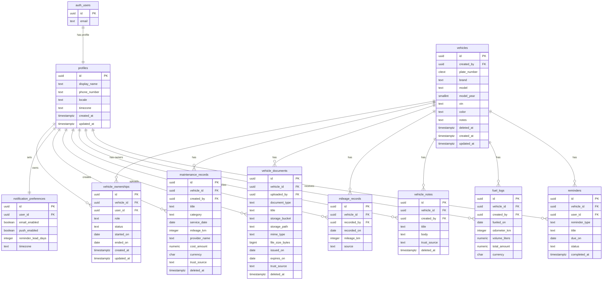

# ER Diagram

Phase 2 database design starts with an ownership-centered model. A user can own vehicles through `vehicle_ownerships`, and all vehicle memory records attach to a vehicle.



## Authorization Rule

The core authorization rule is:

```text
auth.uid() -> profiles.id -> vehicle_ownerships.user_id -> vehicles.id -> vehicle memory
```

If the user is not an active owner/member of a vehicle, they should not see or mutate that vehicle's memory records.
